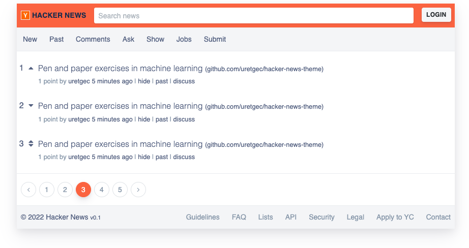

# Hacker-News-Theme
Test Theme for [FiureCMS](https://github.com/fiure-cms). Looks like a hacker news theme but not.
Uses three different languages template engine.

1. [TwigJS](https://github.com/twigjs/twig.js)
2. [TwigPHP](https://github.com/twigphp/Twig)
2. [TemplateGo](https://github.com/golang/go/tree/master/src/html/template)



## Make Some Tests

- TwigJS Tests: Install Gulp (buildMe, watchMe, testMe tasks included)
```
npm install --global gulp-cli

gulp testMe
```

- TwigPHP Tests: Install Composer
```
./vendor/bin/phpunit tests
```

- TemplateGo Tests
```
go test -timeout 30s github.com/uretgec/hacker-news-theme/test
```

### NOTE
- Feel free to use. Good luck.